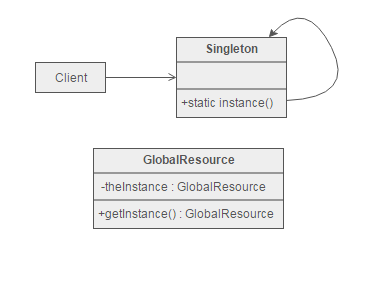
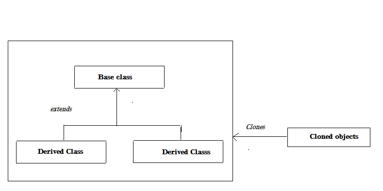
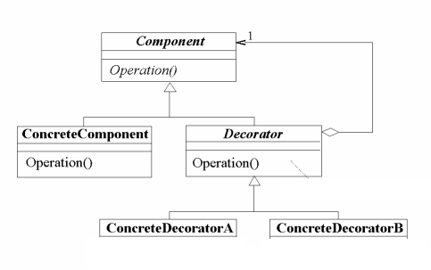
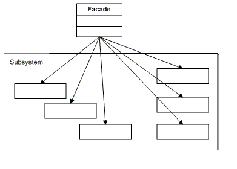
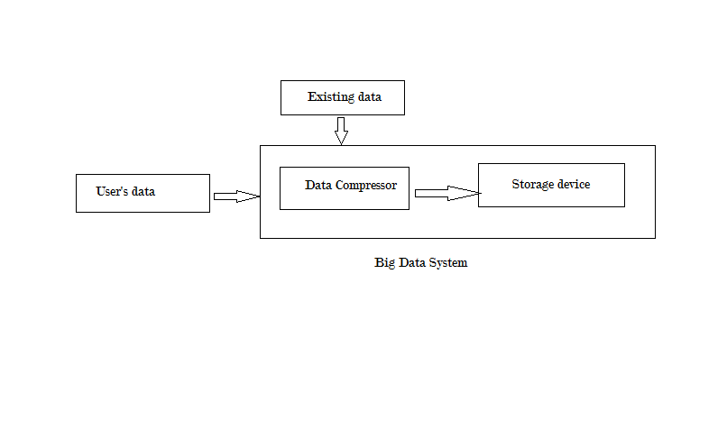
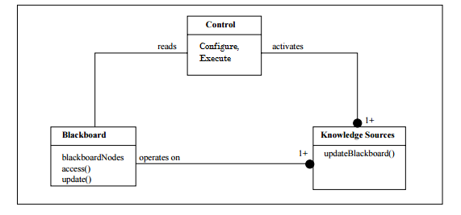

# Patterns

##Creational Design Pattern
### 1) Singleton:
Singleton pattern is used when the application requires only one instance of the object. This design pattern should be such that it allows initializations on demand and should be accessible globally. Singleton pattern is implemented when the ownership of a single instance cannot be distinctly assigned.

</img>

Other design patterns such as Factory, Prototype can implement singleton design in them. Singleton pattern is implemented by declaring all constructors to be private and by providing a static method returning a reference to the instance.

Example:
Consider the CEO of the company. There can always be one CEO for any organization and even though the person can be replaced, the title will be present. Some functions of the CEO will be to provide guidelines and conducting research/development activities.

### 2) Prototype

Prototype pattern refers to creating duplicate object after creation of a single object (Prototype). We have to specify the kinds of objects to create a prototype and later create new objects by copying this prototype. Prototyping is done by defining an abstract class specifying a virtual clone, maintaining the dictionary of all clone-able derived classes. Creating a prototype often means, creating an object to perfection before production of other objects. Keeping performance in mind, even though the cost of initial creation of a prototype is high, the cost of subsequent production of objects is very minimal as prototype will be &#39;cached&#39;. Prototyping, thus avoids creation from scratch, supporting cheaper production of the clones. A subtle difference between factory pattern and prototype is that, prototype pattern implements creation through delegation, whereas factory pattern implements creation through inheritance. Prototype co-opts one instance of a class and be used as a breeder of all future instances.

</img>

Example: Consider car manufacturing, before a car is being mass produced, a single car will be fully built and tested thoroughly and only upon satisfying the requirement, it will be sent for mass production. Now, the cost of building up a single instance is going to be high, but when seen with a broader perspective, this method seems to more efficient and profitable.

##Structural Design Pattern
###1)Decorator

Decorator is a type of structural pattern which is primarily used to embellish the application as per the clients&#39; requirement. This type of design pattern does not implement inheritance for the decoration purpose, instead will add a decorator function to the existing application, without breaking the other functionalities.

</img>

Example:

Consider the same car production. After manufacturing the car in a mass –production manner, all the cars look alike. Thus according to the user&#39;s requirement, a &#39;decorator function&#39; can be used to add extra components like spoilers, bumpers, hoodie etc. The user has the option of choosing which decorator function to use and accordingly embellish the end product.

###2) Façade

The English definition of façade is &quot;An outward appearance that is maintained to conceal a creditable reality&quot;

The Façade design pattern also does the same – wrap a complex subsystem into a simpler one, thus enabling the ease of use for the clients. One effect of using such a design pattern is that, it restricts the features and power of the subsystem, as it allows only a certain level of flexibility to the end users. This type of design patter is followed where the need to abstract the complex activity is high as compared to the need of learning the subsystem.

</img>

Example: Consider a UI that connects to a complex database. The UI will mostly be designed such that the client/user only sees the end result, after fetching from the database. While in reality, complex codes are ran to fetch the data in the appropriate manner, which the user need not necessarily know. Such a system can be considered as a Façade design pattern.

## Behavioral design patterns
###1) Template

Template method is a type of behavioral pattern which defines the skeleton of an algorithm as an abstract class, allowing its subclasses to provide concrete behavior. The interfacing method that the user calls is actually the template method. For analogy purpose, we can even think about the concept of inheritance. The base class will hold a standard set of methods and the derived class can be modified such that new methods can be added, including the ones from the base class. Template Method uses inheritance to vary part of an algorithm whereas strategy uses delegation in modifying the algorithm. Factory method is a special form of template method.

</img>

Example:  Consider the example of an institution which has different departments.  A template method can be used for implementing such a design, as each department shares some common features, like classroom, faculty, No. of students. In addition, each department varies with the courses they offer, laboratories they have etc. Exams and grading methods will be common across all institutions.

###2) State

State pattern is one of the behavioral design patterns which are used when an Object changes its behavior based on its internal state. Such a pattern can be implemented by having a state variable in the object and by using If-Else conditions to select different states. The state machine&#39;s interface is encapsulated in the wrapper class.

</img>

Example: Consider the example of TV remote. A TV remote often has various functionalities, like volume control, program changing, power on/off etc. A remote here acts as the wrapping function and depending the state variable ( the button pressed) the remote performs appropriate actions.

##Freestyle Design Patterns

### BigData Design Patterns: Data Size Reduction Pattern
Storing large amounts of data inside a Big Data solution environment can quickly exhaust the storage capacity, thereby requiring expansion of the existing storage expansion leading to increased costs. On the other hand, transferring very large files inside a cluster can affect the overall data processing time. Thus, a solution to this is to reduce the data’s storage footprint before it is stored in the Big Data Platform. A compression engine mechanism is introduced within the platform which works closely with the data transfer engine. In addition, already acquired data can be processed for a reduced data set.

</img>

###Blackboard Pattern
The blackboard architectural pattern provides a computational framework for the design and implementation of systems that need to integrate large and diverse specialized modules, and implement non-deterministic control strategies. The first step in designing a blackboard pattern is to understand the solution space and to identify the knowledge sources that can provide those solutions. Using these knowledge sources, triggering conditions can be added and input variables should be linked to the data and the results are to be put in the blackboard. The next step is to specify the control component which generally takes the form of a complex scheduler that makes use of a set of domain-specific learning to rate the relevance of executable knowledge sources.
Blackboard patterns are used in domains like speech recognition, radio signal interpretations, etc.

</img>

###Asynchronous Pattern
Asynchronous pattern is a client-side support that doesn't block the calling thread when the system is in a wait state but instead notifies it when a reply arrives. In most languages a called method is executed synchronously. If the method requires long time to complete, for some reasons, the calling thread is blocked until the method has finished. As it is not desired, it is possible to start a "worker thread" and invoke the method from there. Asynchronous pattern augments a potentially long-running (synchronous) object method with an asynchronous variant that returns immediately, along with additional methods that make it easy to receive notification of completion, or to wait for completion at a later time.

##GraphQL-based APIs VS RESTful
GraphQL-based APIs is considered to be an evolved version of RESTful APIs. 
####Advantages for GraphQL compared to REST API:
*	RESTful APIs lacks scalability and the number of requests it makes to the server to gather information is quite high. On the other hand, we can efficiently configure our GrapghQL to fetch all the data in a single request
*	 The responses of the REST APIs will be containing some extra unnecessary information as well. i.e., there is no full control of the response we receive. GraphQL responses are request based and succinct.
*	For GrapghQL, there are no overheads of reading and parsing the JSON responses.
* Readability : GraphQL APIs are easy to read and understand, as compared to REST APIs.

####Disadvantages of GraphQL and Advantages of REST:
* REST uses the HTTP verbs like GET PUT POST DELETE for actions which are easy to understand.
* User has to manually write the API for getting the desired response. Sometimes, when the user wants a chunk of data from the server, using a REST API would be easier than using GraphQL.
* The success of GraphQL is yet to be seen. Thus, the growth of the GraphQL would require a long time. 
* As of now, only Facebook has been using GraphQL effectively and we don’t know how GraphQL would work for other organisations. It requires more time in the industry to become widely used.

Experience of developers:
A developer would be be more comfortable using GraphQL as it is more readable and thus any errors can be easily debugged. Also, GraphQL can be modified to give intelligent responses. Also features like pagination, filtering and sorting helps the developers improving user experience. Although, developers should learn how to process complex queries to make use of GraphQL in an effective manner.
REST: 
Developers should be careful while updating the API, and also should properly document it.Developers needs to create request messages and logic to extract and use the returned data.They may end up making multiple calls to get the data they need.

#Pokemon GO Architecture

</img>

PokemonGo is a game which works on the concept of Augmented Reality. The game's concept is based on the famous comic 'Pokemon'. The following are the primary tasks performned by the App:
* Location based map rendering: The user's location will be plotted in the game using google's server. Pokestops, Gym will be already marked in the map.
* Database: Maintains the user, pokemon,pokestop's data.
* Processing server: Processes the information from the user and responds with appropriate responses. There are many responses. For example, when a user goes near a pokestop, the server will make enable the user to access the pokestop and randomly give accessories (Like pokeballs, potions, etc.). There is always a constant link between the user and the server.
* Other servers: Other than the processing server, other servers to update pokestops, gyms, monitor user location, are also deployed.

The primary concept of the game is Augmented reality. The real-world map will be shown in the game, and the user's location will be shown (Just like google maps). 
Pokestops will be plotted by the server - Normally, pokestops would be famous/historcial/religious places. The pokestop database is based on Niantic's portal database for Ingress. Gym will also be plotted by the server in the map. Pokemon's will be available in random places and can be seen on our phone, only when we are very close to it's location. With the latlong information, the distance between the user and the pokemon will be constantly monitored.

As per my understanding, PokemonGo has various design pattern clubbed together as differnt modules which are as follows:
Adapter Pattern: This pattern is implemented to make the game to be available in different devices (iOS, Android)
Observer Pattern: This pattern is implemented in the user side, constantly monitoring and notifying the server.
Memento Pattern : The state of the user will be saved at each instance and a new memento will be generated at the server so that rollback is possible, when something goes wrong ( Poor network connectivity)
Broker pattern: The authentication is done using the google authentication service using the broker authentication pattern
Abstract Factory Pattern: Pokemons are generated by such a pattern based on whether they are land based, water based, etc.
Object Pool : This pattern is used to connect with the databases.
All the above patterns are encapsulated in different modules, which are together clubbed to form a single application- Pokemon GO

The only constraint that I found in the system is that, since there are large amount of requests generated by the users as well as the servers, the user often gets 'unable to connect'. That is, too many pull requests are generated and thus it has become hard to manage the load. Also, whenever the 
